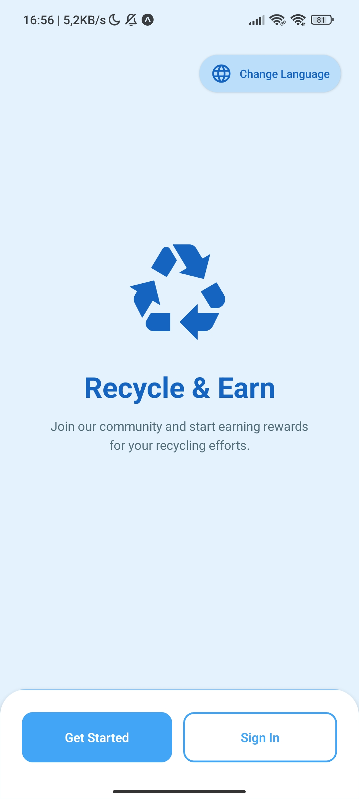
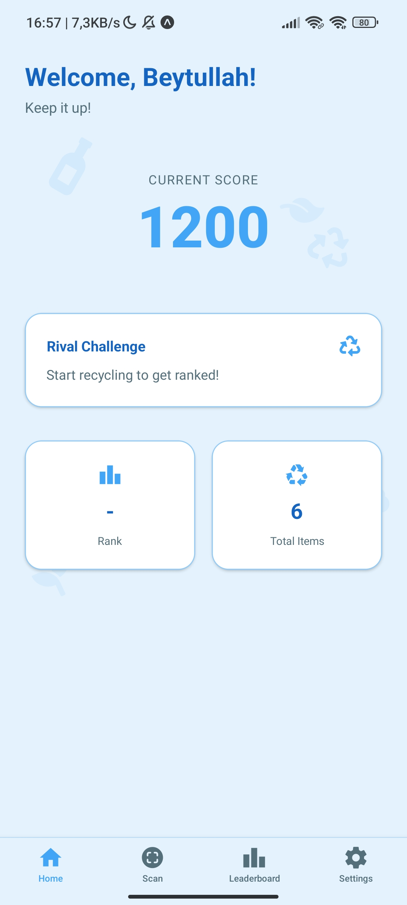
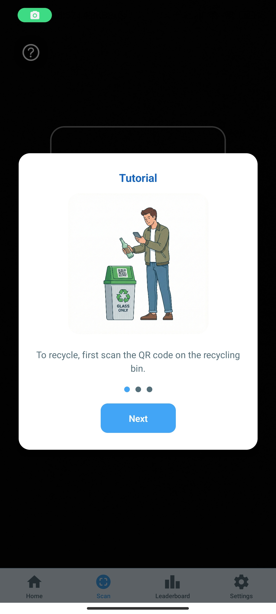
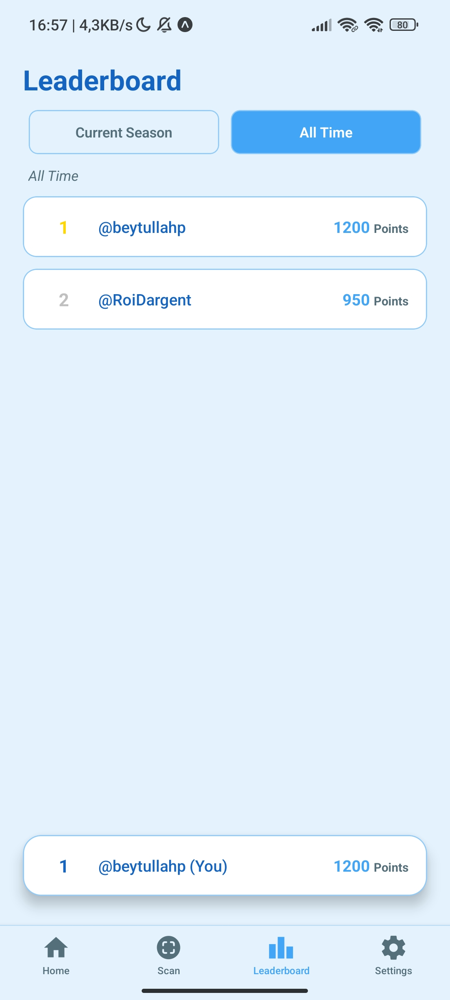
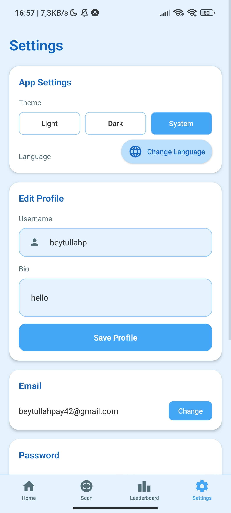

# Recycling Incentive App Expo

This is the mobile application for the **Recycling Incentive App**, developed as a **Tubitak 2209-A** research project.

The goal of this project is to gamify recycling, making it fun and rewarding. Users can scan QR codes on recycling bins, deposit items, and earn points to compete on leaderboards.

---

## 🚀 How It Works

1.  **Create Account:** Sign up to create your profile and start your recycling journey.
2.  **Find a Bin:** Locate a supported recycling bin.
3.  **Scan Bin QR:** Scan the QR code on the bin to start a session.
    - 📍 **Geo-fencing:** You must be within a **20-meter radius** of the bin for verification.
4.  **Recycle Items:** Scan the barcode of the items you are depositing.
    - 📸 **Proof Required:** If you scan multiple items of the same type, the app will flag the transaction and require a photo proof to prevent fraud.
5.  **Earn Points:** Complete the session to earn points.
6.  **Leaderboard:** Compete with others and climb the leaderboard!

---

## 🛠️ Used Technologies

**Frontend:**

- **React Native** (Expo)
- **Typescript**
- `axios` for API communication
- `expo-camera` for scanning QR codes and taking proof photos
- `expo-location` for geo-fencing verification
- `i18n` for internationalization (English, Spanish, Turkish)

**Backend:**

- **Laravel 12** (REST API)
- **Sanctum** for authentication

---

## 🔗 Links & Access

- 📦 **Backend Repository:** https://github.com/Beytullahp42/recycling-incentive-app-backend
- 📦 **Admin Dashboard Repository:** https://github.com/Beytullahp42/recycling-incentive-app-admin-frontend

- 🌐 **Hosted Admin Dashboard:** https://ria-admin.beytullahp.com
- 🔗 **Hosted Backend API:** https://ria-backend.beytullahp.com
- 📱 **Expo Go URL:** `exp://ria-expo.beytullahp.com`

### 📱 Try it on your phone

You can access the app via **Expo Go** (available on Android & iOS) by scanning the QR code below or entering the URL above.

### 🤖 Download for Android

You can also install the application directly by downloading the APK file:

- 📥 **Download:** [ria-1.apk](https://github.com/Beytullahp42/recycling-incentive-app-expo/releases/download/v0.8.0/ria-1.apk) (Raw APK file)
- **Install:** Open the file on your Android device to install.

---

## 📸 Screenshots

  
 
 
